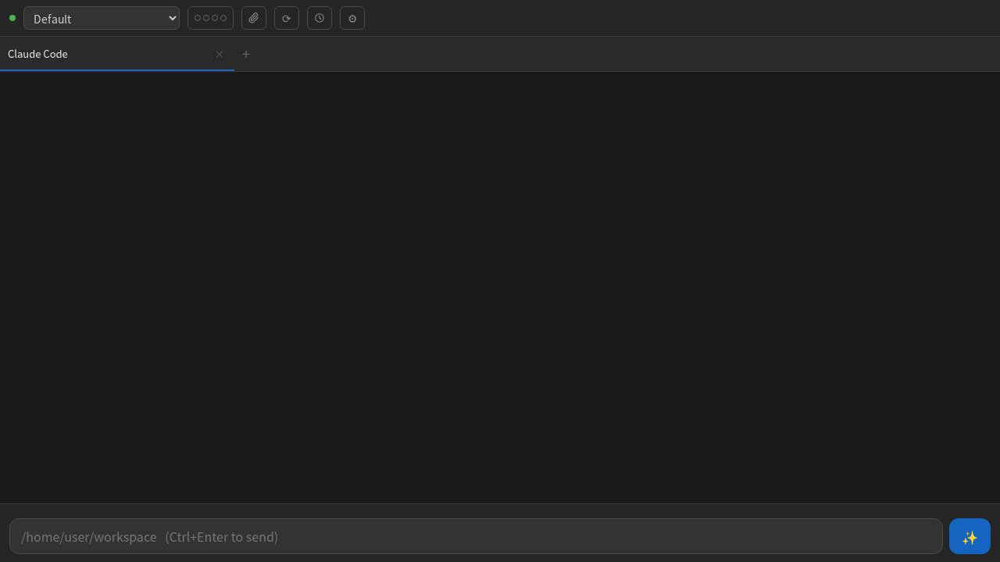
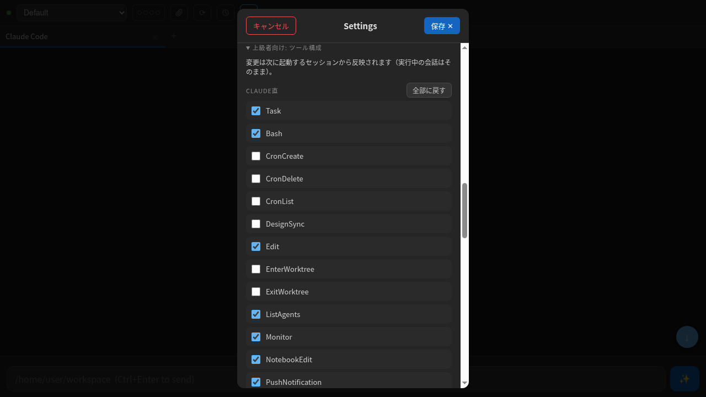

# pocket-claude

**ブラウザから Claude Code を使えるようにします。**

[English](README.md) | 日本語

pocket-claude は Claude Code CLI の Web インターフェースです。Claude Code を使っている方は、これをインストールすることでターミナルではなくブラウザベースの UI で操作できるようになります。

## 何ができるの？

Claude Code CLI を Web アプリに変換：
- **URL にアクセス**して、クリーンな Web インターフェースで Claude Code とチャット
- **スマートフォンやタブレットを使用** - モダンブラウザならスマホからでも利用可能
- **どこからでもアクセス** - VPN、SSH トンネル、ローカルネットワーク経由
- **会話を整理** - タブベースのセッション管理
- **CLAUDE.md に対応** - プロジェクトの CLAUDE.md 設定を尊重

**すべての Claude Code ユーザーが使えます：**
- ローカルPC、自宅サーバー、クラウドVMなど、Claude Codeが動く環境ならどこでも
- ターミナルの代わりにブラウザで操作
- スマホからもアクセス可能
- 複数プロジェクトの切り替えが簡単

**サーバー不要** - Claude Codeがインストールされている場所で `npm install` して実行するだけ。

## 特徴

- **ブラウザベース UI** - デスクトップ・モバイルのブラウザで動作
- **超軽量** - バニラ HTML/CSS/JS、ビルド不要
- **タブベース会話管理** - 複数の会話を同時に管理
- **コンテキスト使用量追跡** - リアルタイムトークン使用量可視化
- **統合履歴ブラウザ** - 過去のセッションを閲覧・再開
- **SSE ストリーミング** - 自動再接続付きリアルタイム出力
- **Markdown レンダリング** - クリーンで読みやすい出力
- **画像添付** - プロンプトに画像を添付（ペースト・ドラッグ＆ドロップ・ファイル選択）
- **予約投稿** - 指定日時にプロンプトを自動送信（サーバーサイド実行、ブラウザ不要）
- **レート制限自動再開** - レート制限が解除されたタイミングで自動的に再送信
- **言語切り替え** - 日本語 / 英語 を設定画面から切り替え可能
- **リクエストボディサイズ制限** - 設定画面から変更可能（MB 単位；0 = 無制限）
- **ポート使用中ガード** - ポートが既に使用中なら明確なメッセージで終了（二重起動による不整合を防止）

## スクリーンショット

### メインインターフェース


### 設定


## なぜ pocket-claude？

既存のソリューションは高機能ですが、依存が重いです。pocket-claude は異なるアプローチを取っています：

- **React/Vite/TypeScript 不要** - Express + バニラ JS のみ
- **セルフホスト特化** - 自宅サーバー環境向け設計
- **ビルド不要** - `npm install` して実行するだけ
- **最小限の依存** - Markdown レンダリングに marked.js のみ使用

## クイックスタート

**最もシンプルなインストール（Claude Code で導入可能）：**

```bash
git clone https://github.com/tarou0080/pocket-claude.git
cd pocket-claude
npm install
npm start
```

`http://localhost:3333` でアクセス可能

これだけです！設定なしでそのまま動きます。

### オプション設定

**カスタムプロジェクトディレクトリを追加** (`projects.json`):
```json
{
  "home": "/home/user",
  "work": "/home/user/workspace",
  "myproject": "/path/to/project"
}
```

**設定を変更** (`config.json`):
```json
{
  "port": 3333,
  "host": "0.0.0.0",
  "permissionMode": "acceptEdits",
  "sessionDir": "./sessions",
  "logsDir": "./logs",
  "maxBodySizeMb": 0
}
```

サンプルからコピー:
```bash
cp config.example.json config.json
cp projects.example.json projects.json
```

**特定モデルだけプロキシ経由にする** (`proxyModels`・任意):

```json
{
  "models": [
    { "value": "my-proxy-model", "label": "My Proxy Model" }
  ],
  "proxyModels": {
    "my-proxy-model": {
      "ANTHROPIC_BASE_URL": "http://localhost:3456",
      "ANTHROPIC_API_KEY": "your-proxy-key"
    }
  }
}
```

`proxyModels` に載せたモデルは、そのモデルを選んだセッションの `claude` プロセスにのみ上記の環境変数が注入され、Anthropic互換の任意のエンドポイント（claude-code-router・LiteLLM 等の翻訳プロキシ、社内ゲートウェイなど）経由にできます。他のモデルのセッションはプロキシに一切依存しないため、プロキシが停止しても影響は該当モデルのみです。CHANGELOG の「GLM-5.2（Cloudflare）」はこの仕組みの利用例であり、内蔵モデルではありません。

> **Fable 5 の課金について（2026-07-20時点）:** Anthropic は Fable 5 をプラン別に課金します。**Max / Team Premium** は**サブスクに含まれる**（週制限の50%まで）。**Pro / Team Standard** は一度きりの $100 usage credit 付与後、**従量課金**（$10 / $50 per 100万入力/出力トークン）に落ちます。pocket-claude は利用者のプランを判別できないため、既定のモデルリストでは `Fable 5 (Pro: metered)` と表示します（Pro ユーザーは従量課金に注意・Max ユーザーは無視可）。ラベルは `config.json`（または `public/index.html` の `ALL_MODELS`）で自分のプランに合わせて変更できます。

### 前提条件

- Node.js v18+
- [Claude Code CLI](https://code.claude.com/) がインストール・認証済み

## プロジェクト管理

pocket-claude では、ブラウザまたは設定ファイルでプロジェクトディレクトリを管理できます。

### ブラウザから追加（推奨）

1. ヘッダーの **⚙**（設定）ボタンをクリック
2. **プロジェクト** セクションまでスクロール
3. プロジェクト名とディレクトリパスを入力して **追加** をクリック

設定はサーバー再起動後も保持されます。

### 設定ファイルで管理

`projects.json` を編集してプロジェクトを定義：

```json
{
  "home": "/home/user",
  "myapp": "/srv/shell/myapp",
  "website": "/var/www/html"
}
```

### 環境変数で追加

起動時に環境変数でプロジェクトを追加することもできます：

```bash
export ADDITIONAL_ALLOWED_DIRS="/srv/shell:/opt/projects"
npm start
```

これらは `env_0`, `env_1` という名前で自動追加されます。

## 設定オプション

### パーミッションモード

- `"ask"` (デフォルト) - ツール実行前に確認
- `"bypassPermissions"` - 全ツール実行を自動承認

⚠️ **セキュリティ警告**: `bypassPermissions` モードは Claude Code が確認なしでツールを実行できます。VPN + 2FA などの適切な認証がある信頼できる環境でのみ使用してください。

## モデル選択

モデルのプルダウンには、ピン留めされたモデルIDではなく **ティアエイリアス** が入っています：

| プルダウンの選択肢 | `claude` に渡される値 | 解決先 |
|---|---|---|
| Default | （`--model` を渡さない） | CLI 自身の既定モデル |
| Fable / Opus / Sonnet / Haiku | `--model sonnet` など | そのティアの**最新**モデル |

エイリアスは起動時に Claude Code CLI 自身が解決するため、Anthropic が新しいモデルを出すと自動的に反映されます（設定編集は不要）。プルダウンは各選択肢のラベルを、CLI が実際に解決した具体モデル名（`system/init` イベントから実測）へ書き換えます。例えば `Sonnet` は `Sonnet 5` に、`Default` は `Default (Sonnet 5)` になり、**実際に何が動くか**が常に見えます。

> ⚠️ **Claude Code CLI を最新に保ってください。** エイリアスが最新モデルへ追従するのは、**インストール済みの CLI が知っている範囲まで**です。CLI が古いと `sonnet` などが**古いモデル**へ解決されます（CLI が約47版古かったために `sonnet` が Sonnet 5 ではなくレガシーな 4.6 に解決された事例があります）。次で更新してください：
>
> ```bash
> npm install -g @anthropic-ai/claude-code@latest
> ```
>
> 判断の目印はプルダウンの実解決名です。`Default (…)` や `Sonnet` が想定より古いモデルを表示していたら、CLI が古くなっています。

自動で最新に保つには cron を設定してください（環境に合わせて調整）：

```bash
# 毎週月曜 03:00 に Claude Code CLI を更新
0 3 * * 1 npm install -g @anthropic-ai/claude-code@latest >> ~/claude-cli-update.log 2>&1
```

### 特定（または古い）モデルにピン留めする

「ティアの最新」ではなく特定のモデルを使いたい場合 — 古いモデルに留まりたい、既定リストに無いモデルを足したい — は、プルダウンの選択肢の `value` に正確なモデルIDを設定します。この値は `claude --model <value>` にそのまま渡されます。

`config.json` に追加します（再起動で反映。このファイルはコミットされません）：

```json
{
  "models": [
    { "value": "",                "label": "Default" },
    { "value": "sonnet",          "label": "Sonnet (latest)" },
    { "value": "claude-opus-4-1", "label": "Opus 4.1 (pinned)" }
  ]
}
```

- モデルIDは [models overview](https://platform.claude.com/docs/en/about-claude/models/overview) の正確なIDを使ってください（誤ったIDは `claude` が 404 を返します）。
- ピン留めIDは**自動更新されません**。それが狙いです。同じリスト内でエイリアス（自動最新）とピン留め（固定）を混在できます。
- `config.json` は gitignore（インスタンス固有）です。新規 clone が既定で見る内容を変えるには、代わりに `public/index.html` の `ALL_MODELS` を編集してください。

## 設定パネル

ヘッダーの **⚙** パネルから以下を調整できます：

- **Effort（思考量）** — 全セッションに適用されるグローバル既定の思考量（`Auto` / `Low` / `Medium` / `High`）。ヘッダーの Effort ドット（**●●●**）は、既定を変えずに*現在のタブだけ*の Effort をサイクル切り替えします。
- **テーマ** — 同梱の UI テーマ（Blue Dark / Purple Dark）を切り替え。`public/themes.js` を編集すれば独自テーマを追加できます。
- **フォントサイズ** — 会話テキストのサイズを調整。
- **言語** — 日本語 / 英語。
- **リクエストボディサイズ制限** — アップロード上限（MB 単位、`0` = 無制限）。大きな画像を添付するときに有用。

設定はブラウザに保存され、再起動後も保持されます。

## 使い方メモ

- **質問はタップ選択ではなくテキストで来ます。** ヘッドレスモードの CLI は対話型の選択肢ツール（`AskUserQuestion`）を使えないため、Claude は質問を通常のテキストで行い、あなたは通常の入力欄で回答します。選択肢ボタンは出ません（意図的な仕様。技術的理由は CHANGELOG 参照）。
- **画像添付** — クリップアイコン（📎）・ペースト・入力欄へのドラッグで画像を添付できます。テキストのみ・画像のみの送信も可能です。
- **予約投稿** — プロンプトを指定日時に実行するよう予約できます。サーバーサイドで実行されるため、ブラウザを開いたままにする必要はありません。各予約は状態（待機中／実行中／失敗）を持ちます。配送に失敗した予約は消えず、理由付きで一覧に残り、再送・編集・削除ができます。削除すると本文が入力欄の草稿へ戻ります。サーバー停止中に時刻を過ぎた予約は、遅れて実行されず失敗として記録されます。
- **レート制限自動再開** — Claude のレート制限が解除されると、待機中のプロンプトが自動的に再送されます。入力欄の上に再開カードが出て、実キック時刻とカウントダウンを表示します。設定で「デフォルトで自動再開」を有効にすると、制限のたびに自動でセットされます。
- **停止はセッションではなくターンを中断** — 実行中にステータスドットをタップすると、CLIの制御プロトコル経由で現在のターンだけを中断します。セッションの `claude` プロセスは生き続けるため、次のプロンプトは再起動なしで同じセッションのまま続きます。制御メッセージ非対応のCLIバージョンではプロセス終了へフォールバックします（その場合は次のプロンプトでセッションを再開します）。

## アーキテクチャ

```
[モバイルブラウザ]
    ↓ HTTP
[pocket-claude (Node.js/Express)]
    ↓ spawn
[claude CLI (headless mode)]
    ↓
[プロジェクトディレクトリ]
```

- **フロントエンド**: バニラ JavaScript の単一 HTML ファイル
- **バックエンド**: セッションごとに `claude` の常駐プロセスを管理する Express サーバー（stream-json モード）
- **通信**: ストリーミング用 Server-Sent Events (SSE)
- **セッション管理**: 永続化用 JSON ファイル

## セキュリティ上の考慮事項

pocket-claude は **ローカル/信頼できるネットワーク用** に設計されています：

- **ローカルネットワークのみ** - デフォルトで localhost または LAN で動作
- **バインド先アドレスの限定** - `config.json` の `host`（または環境変数 `HOST`）で listen するインターフェースを限定可能。リバースプロキシ経由のアクセスのみに絞りたい場合に使用（デフォルト: `0.0.0.0`）
- **パーミッションモード** - より安全な操作のため `permissionMode: "acceptEdits"` を使用。指定できる値は `claude --permission-mode` が受け付けるもの（`acceptEdits` / `auto` / `bypassPermissions` / `manual` / `dontAsk` / `plan`）。未知の値を書くとCLIが起動を拒否する
- **信頼できる環境** - 公開インターネットへの露出向けではありません

リモートアクセスには、サーバーを直接公開するのではなく、VPN または SSH トンネルの使用を検討してください。

> **信頼モデル**: pocket-claude はプロジェクトとして登録できるディレクトリを**制限しません**。API に到達できる者（あるいは `projects.json` を編集できる者）は、サーバー実行ユーザーがアクセスできる任意のディレクトリで `claude` を実行でき、`bypassPermissions` 下では実質的に任意コマンド実行が可能です。これは設計上の意図です。pocket-claude はアクセス制御をネットワーク/認証層（VPN、リバースプロキシ認証、ファイアウォール）へ委譲する薄いラッパーです。信頼できないクライアントへ公開しないでください。

### 環境変数

追加のディレクトリへのアクセスを許可するには `ADDITIONAL_ALLOWED_DIRS` を設定してください（コロン区切り）：

```bash
export ADDITIONAL_ALLOWED_DIRS="/srv/shell:/opt/projects"
npm start
```

## スコープ外

pocket-claude は意図的にミニマルです。以下の機能は**計画されていません**：

- **ファイルエディタ** - VSCode またはお好みのエディタを使用してください
- **ターミナルエミュレータ** - SSH またはネイティブターミナルを使用してください
- **マルチユーザーサポート** - シングルユーザー、信頼できる環境向け設計
- **データベース統合** - セッションデータはシンプルな JSON ファイルに保存
- **認証システム** - ネットワークレベルのセキュリティ（VPN、ファイアウォール）に依存

これらの機能が必要な場合は以下を検討してください：
- [claudecodeui](https://github.com/siteboon/claudecodeui) - フル機能 Web IDE
- [claude-relay](https://github.com/chadbyte/claude-relay) - より高度な機能

## トラブルシューティング

### Claude CLI が見つからない
Claude Code CLI がインストールされ、PATH に含まれていることを確認してください：
```bash
which claude
```

### パーミッション拒否エラー
pocket-claude を実行しているユーザーがプロジェクトディレクトリを読み取り可能か確認してください。

### SSE 接続の問題
nginx を使用している場合、バッファリングが無効になっていることを確認してください：
```nginx
proxy_buffering off;
proxy_cache off;
```

### ポートが既に使用中
`config.json` でポートを変更するか、`PORT` 環境変数を設定してください：
```bash
PORT=3334 npm start
```

### プロジェクトディレクトリが見つからない
プロジェクトの追加に失敗する場合：

1. ディレクトリが存在するか確認：
   ```bash
   ls -ld /path/to/project
   ```

2. 読み取り権限があるか確認：
   ```bash
   # pocket-claudeを起動しているユーザーで実行
   cd /path/to/project
   ```

3. サーバーログで詳細を確認：
   ```
   [WARNING] Invalid project path: myproject -> /srv/shell (No such file or directory)
   ```

## ライセンス

MIT License - 詳細は [LICENSE](LICENSE) ファイルを参照してください。

## 謝辞

- [marked.js](https://github.com/markedjs/marked) - Markdown パーサー (MIT)
- [Express](https://expressjs.com/) - Web フレームワーク (MIT)

以下のプロジェクトからインスピレーションを得ました：
- [claude-code-webui](https://github.com/sugyan/claude-code-webui) by sugyan
- [claudecodeui](https://github.com/siteboon/claudecodeui) by siteboon
- [claude-relay](https://github.com/chadbyte/claude-relay) by chadbyte

## コントリビューション

コントリビューション歓迎！お気軽に Pull Request を送信してください。

## サポート

- Issues: [GitHub Issues](https://github.com/tarou0080/pocket-claude/issues)
- Discussions: [GitHub Discussions](https://github.com/tarou0080/pocket-claude/discussions)
